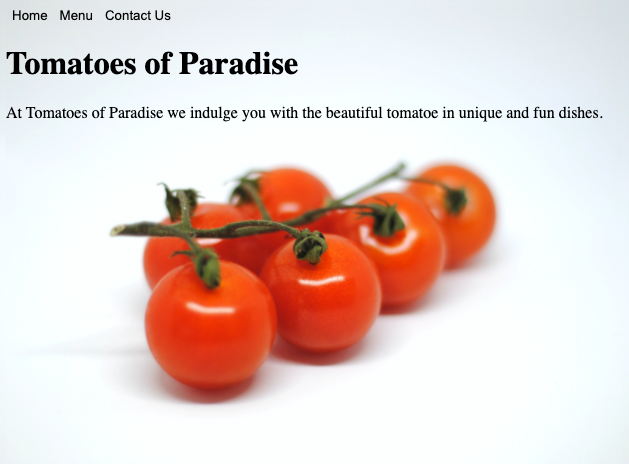

# restaurant

A restaurant website. This project reinforces the concepts of npm, module export and import, as well as DOM manipulation with JS.

    

## Features

- Dynamically renders each page.
- Utilizes webpack and module export and import.

## Demo

- https://cameronstamant.github.io/restaurant/
